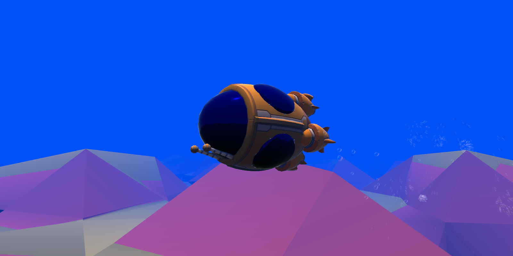

# Game Development Techniques

Hi! My name is Luiz, I am an aspring game developer and this is a repository where I will be putting the projects I will create throughout my journey. I will be trying to roughly follow [this roadmap](https://github.com/utilForever/game-developer-roadmap) by [Chris Ohk](https://github.com/utilForever). Many of the projects you will see here are inspired by a few of my favorite content creators, I absolutely recommend you to check them out:

* [Freya Holmér](https://www.youtube.com/c/Acegikmo)
* [Sebastian Lague](https://www.youtube.com/c/SebastianLague)
* [Stylized Station](https://www.youtube.com/c/StylizedStation)

I would also recommend you to check out this other creators who does not (necessarily) inspired the content of this repository, but are a solid option to learn about game art, design, optimization, marketing and development in general:

* [Game Maker's Toolkit](https://www.youtube.com/c/MarkBrownGMT)
* [Ask Gamedev](https://www.youtube.com/c/AskGamedev)
* [Acerola](https://www.youtube.com/c/Acerola_t)
* [Daryl Talks Games](https://www.youtube.com/c/DarylTalksGames)
* [Dani](https://www.youtube.com/c/DaniDev)

Whithout further ado, let's get to the projects!

- [Game Development Techniques](#game-development-techniques)
  - [🚤 Marching Cubes](#-marching-cubes)
    - [Implementation](#implementation)
    - [Result](#result)
    - [Learining resources](#learining-resources)
    - [Credits](#credits)
  - [Compute Shaders](#compute-shaders)
    - [Implementation](#implementation-1)

## 🚤 Marching Cubes

  

[Marching Cubes](https://en.wikipedia.org/wiki/Marching_cubes) is a procedural polygonization algorithm that will generate natural looking meshes based on a grid of points. It is a very popular technique used in many applications, such as terrain generation, fluid simulation, voxel rendering and many others. The technique was first described by William E. Lorensen and H. E. Cline in 1987.

The algorithm works by creating a tridimensional grid of points, where each point has a value (often reffered at as "density") that indicates wheter the points is located at the interior or the exterior of the mesh. The code slides (marches) a cube through the grid and creates polygons by interpolition of the position of adjacent points. The polygons are then connected to form a mesh.

  
   
  Image from <a href="http://shamshad-npti.github.io/implicit/curve/2016/01/10/Marching-Cube/">Shamshad Alam's blog</a>

There are 256 possible formations for a cube (however, some of them are symmetrical, therefore are redundant and can be reduced to 15 unique formations). Each formation is represented by a 12-bit (one bit per edge, where 1 indicates the presence of a triangle vertex on that adge, whilst 0 represents the absence) integer, where each bit indicates wheter a vertex is inside or outside the mesh.

### Implementation

My implementation of this algorithm was inspired by [this video by Sebastian League](https://youtu.be/M3iI2l0ltbE). His implementation used compute shaders to make the mesh generation parallel, thus, it is able to have more polygons beeing generated without heaving great impact on performance. For now, my implementation is written in C# and runs on the CPU, so it is not parallelized, but I plan to do so in the future. I tried not to look at his code, which is also available on Github in order not to be biased in any way during my implementation.

The example presented on the `MarchingCubes.unity` scene has two main mono behavior classes: the surface manager and the chunk. The surface manager is responsible for creating, deleting and updating the chunks according to the position of the player. The chunk is responsible for generating the mesh and updating it when necessary.

Each chunk generates the values for the points in his grids and uses the tables in `Tables.cs` to generate the mesh triangles accordingly - this is the part I wish to write a compute shader for. The mesh is then updated and rendered. Right now there is only one way to generate values for the points which is a RNG based strategy, but along with the compute shader I plan to implement a noise map based approach.

### Result

You can check out a video of the result [here](https://www.youtube.com/watch?v=SCsOzZVZ7ic)

  
  
  
  

### Learining resources

* [Polygonising a scalar field](http://paulbourke.net/geometry/polygonise/)
* [Generating Complex Procedural Terrains Using the GPU](https://developer.nvidia.com/gpugems/gpugems3/part-i-geometry/chapter-1-generating-complex-procedural-terrains-using-gpu)
* [Marching Cubes: a High Resolution 3D Surface Costruction Algorithm](https://people.eecs.berkeley.edu/~jrs/meshpapers/LorensenCline.pdf) (the original papper for the algorithm)

### Credits

* Music: [Gateway](https://pixabay.com/music/ambient-gateway-110018/) by DSTechnician
* Sound effects: [Underwater Ambience](https://pixabay.com/sound-effects/underwater-ambience-6201/) by Fission9

## Compute Shaders

  

Compute shaders are a way to write programs that run on the GPU instead of the CPU. They can drastically increase the performance of many applications, especially those that contains heavy operations that can be parallelized. Compute shaders are mote commonly used for rendering, mesh generation and physics simulations, but there are plenty of ther scenarios where one could use them.

Unity supports a few languages for compute shader implementation, among them are [HLSL](https://learn.microsoft.com/pt-br/windows/win32/direct3dhlsl/dx-graphics-hlsl) and GLSL. On your C# code you can provide data for the shader scripts and read back the results, this powerfull feature will allow you to send in information from the objects in your scene, as well as things like transformation matrices and configuration parameters. This will be usefull for the Marching Cubes project, where I will use compute shaders to parallelize the mesh generation.

### Implementation

For this project, I based myself on [this article](http://blog.three-eyed-games.com/2018/05/03/gpu-ray-tracing-in-unity-part-1/) which explains how to implement a simple ray tracer in Unity using compute shaders. The article is very well written and easy to follow, so I will not go into much detail here, but you should definetly check it out if you are interested in this topic.

🚧 Under construction 🚧

