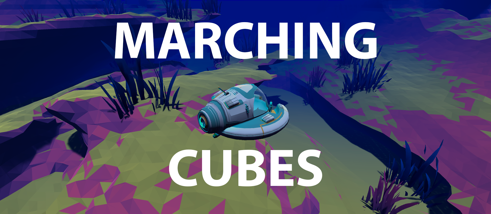

# Game Development Techniques

Hi! My name is Luiz, I am an aspring game developer and this is a repository where I will be putting the projects I will create throughout my journey. I will be trying to roughly follow [this roadmap](https://github.com/utilForever/game-developer-roadmap) by [Chris Ohk](https://github.com/utilForever). Many of the projects you will see here are inspired by a few of my favorite content creators, I absolutely recommend you to check them out:

* [Freya Holmér](https://www.youtube.com/c/Acegikmo)
* [Sebastian Lague](https://www.youtube.com/c/SebastianLague)
* [Stylized Station](https://www.youtube.com/c/StylizedStation)

I would also recommend you to check out this other creators who does not (necessarily) inspired the content of this repository, but are a solid option to learn about game art, design, optimization, marketing and development in general:

* [Game Maker's Toolkit](https://www.youtube.com/c/MarkBrownGMT)
* [Ask Gamedev](https://www.youtube.com/c/AskGamedev)
* [Acerola](https://www.youtube.com/c/Acerola_t)
* [Daryl Talks Games](https://www.youtube.com/c/DarylTalksGames)
* [Dani](https://www.youtube.com/c/DaniDev)

Whithout further ado, let's get to the projects!

- [Game Development Techniques](#game-development-techniques)
  - [🚤 Marching Cubes](#-marching-cubes)
    - [Implementation](#implementation)
    - [Learining resources](#learining-resources)
    - [Credits](#credits)
  - [🔮 Compute Shaders](#-compute-shaders)
    - [Implementation](#implementation-1)

## 🚤 Marching Cubes

  

[Marching Cubes](https://en.wikipedia.org/wiki/Marching_cubes) is a procedural polygonization algorithm that will generate natural looking meshes based on a grid of points. It is a very popular technique used in many applications, such as terrain generation, fluid simulation, voxel rendering and many others. The technique was first described by William E. Lorensen and H. E. Cline in 1987.

The algorithm works by creating a tridimensional grid of points, where each point has a value (often reffered at as "density") that indicates wheter the points is located at the interior or the exterior of the mesh. The code slides (marches) a cube through the grid and creates polygons by interpolition of the position of adjacent points. The polygons are then connected to form a mesh.

  
   
  Image from <a href="http://shamshad-npti.github.io/implicit/curve/2016/01/10/Marching-Cube/">Shamshad Alam's blog</a>

There are 256 possible formations for a cube (however, some of them are symmetrical, therefore are redundant and can be reduced to 15 unique formations). Each formation is represented by a 12-bit (one bit per edge, where 1 indicates the presence of a triangle vertex on that adge, whilst 0 represents the absence) integer, where each bit indicates wheter a vertex is inside or outside the mesh.

### Implementation

My implementation of this algorithm was inspired by [this video by Sebastian League](https://youtu.be/M3iI2l0ltbE). The first version of my code used CPU generated chunks, unlike Sebastian's implementation which used compute shaders to make the mesh generation parallel, thus, it was able to have more polygons beeing generated without heaving great impact on performance. Eventually I also got my implementation to use compute shaders and I will put a side-by-side comparison down bellow. I tried not to look at his code, which is also available on Github in order not to be biased in any way during my implementation, however there were some moments when I used his source code as a reference (for instance, when trying to figure out how the heck was I supposed to know how many triangles my shader had generated).

The example presented on the `MarchingCubes.unity` scene has three main mono behavior classes: the surface manager and the CPU and GPU chunks. The surface manager is responsible for creating, deleting and updating the chunks according to the position of the player. The chunk is responsible for generating the mesh and updating it when necessary.

The surface manager is a singleton that is associated with a prefab where you can manage the mesh settings like chunk size, chunk resolution, number of chunks per batch and whatnot. The surface is also where you select whether you want to use the CPU or GPU implementation.

Each chunk generates the values for the points in his grid and uses the tables in `Tables.cs` to generate the mesh triangles accordingly - this is the part I wish to write a compute shader for. The mesh is then updated and rendered. Right now the meshes are generated with RNG for the CPU implementation and with noise maps for the GPU implementation, you will probably notice that the noise map based generation gives us much more organic looking meshes.

You can check out a video of the result [here](https://www.youtube.com/watch?v=SCsOzZVZ7ic), however on this particular video I had not yet implemented the GPU version, so the environment is very low poly and artificial looking. On the screen shots below you can see the difference between the CPU (left) and GPU (right) implementations.

  
  
  
  

### Learining resources

* [Polygonising a scalar field](http://paulbourke.net/geometry/polygonise/)
* [Generating Complex Procedural Terrains Using the GPU](https://developer.nvidia.com/gpugems/gpugems3/part-i-geometry/chapter-1-generating-complex-procedural-terrains-using-gpu)
* [Marching Cubes: a High Resolution 3D Surface Costruction Algorithm](https://people.eecs.berkeley.edu/~jrs/meshpapers/LorensenCline.pdf) (the original papper for the algorithm)

### Credits

* Music: [Gateway](https://pixabay.com/music/ambient-gateway-110018/) by DSTechnician
* Sound effects: [Underwater Ambience](https://pixabay.com/sound-effects/underwater-ambience-6201/) by Fission9

## 🔮 Compute Shaders

  

Compute shaders are a way to write programs that run on the GPU instead of the CPU. They can drastically increase the performance of many applications, especially those that contains heavy operations that can be parallelized. They are most commonly used for rendering, mesh generation and physics simulations, but there are plenty of ther scenarios where one could use them.

Unity supports a few languages for compute shader implementation, among them are [HLSL](https://learn.microsoft.com/pt-br/windows/win32/direct3dhlsl/dx-graphics-hlsl) and GLSL. On your C# code you can provide data for the shader scripts and read back the results, this powerfull feature will allow you to send in information from the objects in your scene, as well as things like transformation matrices and configuration parameters.

For now we will try to implement a ray tracer, the basic idea is to simulate rays bouncing around the scene and calculating the color of each pixel based on the surfaces the ray for that pixel hits. In real life, light rays are shot from light sources and travel in a similar way until they reach a spectator's eye, but in a computer we can't really do that because we would have to simulate so many light rays that it would be nearly impossible to do it in real time. Fortunately, we don't have to, as [Helmholtz reciprocity principle](https://en.wikipedia.org/wiki/Helmholtz_reciprocity) notes that the light that reaches our eyes is the same light that was emitted by the light source. This means that we can simulate the light by shooting rays the other way around, from the spectator's eye to the light source, this way we avoid having to calculate rays that would never reach the camera anyways.

The way light bounces of objects depends on their material properties, we will be focusing on albedo and specular reflections, smoothness/glossyness and emission. The albedo channel of the material determines the color of the object, while the specular channel determines how much light is reflected by the object (well, technically, the albedo value also determines light reflection, but in a different way), the smoothness or glossyness determines how sharp reflections look on a surface and finally, emission is the light that is irradiated from the object.

### Implementation

For this project, I based myself on the article "GPU Ray Tracing in Unity" by [David Kuri](http://three-eyed-games.com/author/daerst/), you can check out [part one](http://blog.three-eyed-games.com/2018/05/03/gpu-ray-tracing-in-unity-part-1/), [part two](http://three-eyed-games.com/2018/05/12/gpu-path-tracing-in-unity-part-2/) and [part three](http://three-eyed-games.com/2019/03/18/gpu-path-tracing-in-unity-part-3/) which explains how to implement a ray tracer in Unity using compute shaders.

By the time I am writting this, I have only gone through the first and second parts of the article and perhaps that is all I will cover, but in any case, I will make sure to update this section with more information as I progress.

On the screenshot bellow, you can see how the leftmost sphere reflects all colors of light roughly equally, while the middle sphere reflects mostly blue light, this is due to their specular values. You can also see that the sphere on the right has a very low specular value, this means that it will hardly reflect any specular light, but it will reflect a lot of diffuse light, which is the light that is reflected by the albedo channel. To simulate this behavior we simpy shoot a ray from the camera and bounce him arround the scene until it either hits the sky, runs out of energy (which is lost at each bounce) or reaches a established maximum number of bounces. The color of the pixel is then calculated based on the color of the surface the ray hit and the color of the light that bounced off of it.

  

Now you may notice that this gives us very nice reflections, however, the shadow on the orange sphere does not look quite as nice, and this is because we are not taking into account the light that is reflected by surrounding objects. Also, currently we only have this perfect reflections where everything looks extra sharp as if all the objects were mirrors, but what if we wanted more smooth reflections? Then our render gets a little more complicated, to realisticly calculate the exact light tha is reflected by a point of an object, we have to calculate the equation:

<h4 align="center">
L( x, w0 ) = Le( x, w0 ) + ∫Ω fr( x, wi, w0 ) ( wi • n ) L( x, wi ) dwi
</h4>

I won't go into too much details because this is not a tutorial nor am I an expert, but the forementioned article discusses this equation bit by bit. The simple idea is that we have to sum the light that comes from all directions into the point we want to define the color for, to add insult to injury, note that this equation is recursive, which means that we have to calculate the light that comes from all directions, and then calculate the light that comes from all directions of those directions, and so on. This is a very expensive operation and we can't really calculate the integral for that, so we use a probabilistic method called [Monte Carlo integration](https://en.wikipedia.org/wiki/Monte_Carlo_integration) to sample the scene in real time. This gives us a noisy image for a while but very quickly it converges to a nice scene with light emissions and photorealistic textures like the image bellow.

  

